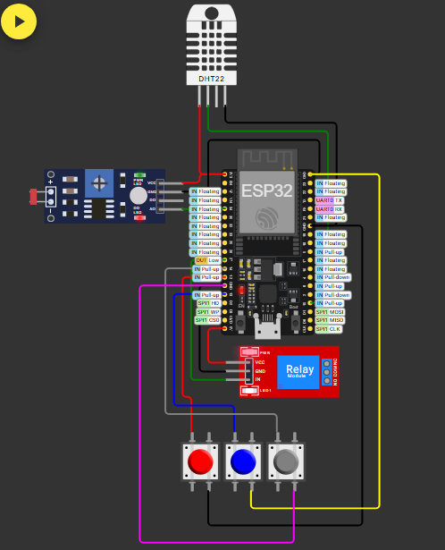
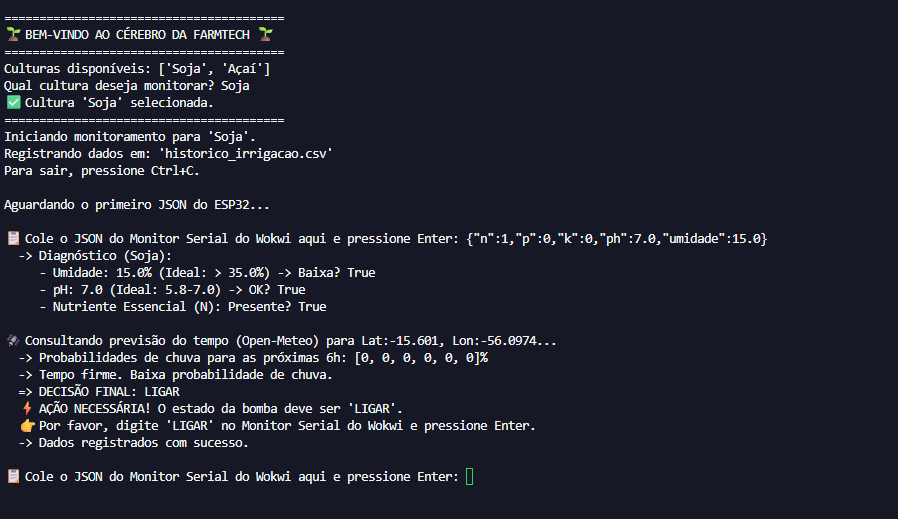
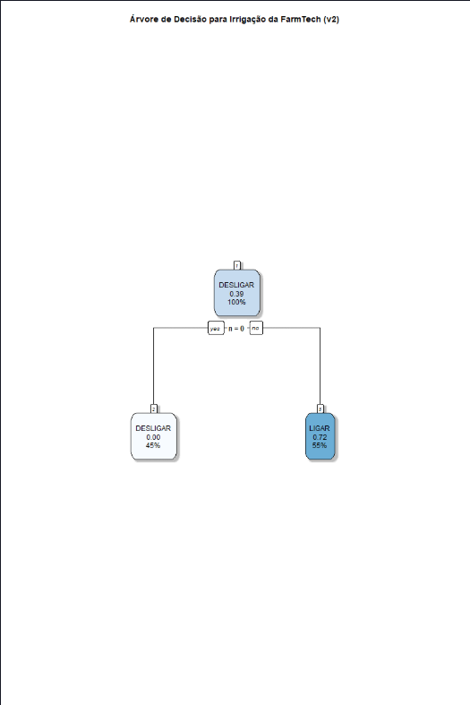

# 🌱 FarmTech Solutions — Fase 2: Sistema de Irrigação Inteligente

> **Status:** Protótipo funcional, validado em simulação Wokwi, com integração de API de clima e análise de dados em R.

---

## 🧭 Sumário
- [1. Equipe](#equipe)
- [2. Descrição do Projeto](#descricao)
- [3. Arquitetura e Lógica do Sistema](#arquitetura)
- [4. Circuito no Wokwi](#circuito)
- [5. Códigos do Projeto](#codigos)
- [6. Programa "Ir Além" (Opcionais 1 e 2)](#opcionais)
- [7. Como Executar a Simulação](#executar)
- [8. Vídeo de Demonstração](#video)

---

## 1. Equipe

* **ENZO NUNES CASTANHEIRA GLORIA DA SILVA** – RM567599
* **LARISSA NUNES MOREIRA REIS** – RM568280
* **PEDRO HENRIQUE LOPES DOS SANTOS** – RM568359
* **FABRICIO MOUZER BRITO** – RM566777
* **GABRIEL RAPOZO GUIMARÃES SOARES** – RM568480

---

## 2. Descrição do Projeto

Este projeto implementa um sistema de irrigação inteligente e automatizado, simulando um dispositivo eletrônico para coleta de dados em uma fazenda. Utilizando um ESP32 na plataforma Wokwi, o sistema monitora em tempo real a umidade do solo, o pH e os níveis de nutrientes (NPK).

A inteligência do sistema, desenvolvida em Python, processa esses dados, consulta uma API de clima para verificar a previsão de chuva e toma decisões assertivas sobre quando acionar a bomba de irrigação, otimizando o uso de recursos hídricos e garantindo a saúde da lavoura.

---

## 3. Arquitetura e Lógica do Sistema

A arquitetura foi dividida em dois componentes principais que se comunicam via "ponte manual" (copiando e colando dados via terminal), conforme sugerido pela proposta do projeto para o ambiente Wokwi.

* **O "Corpo" (Hardware ESP32):** Responsável por ler os sensores (DHT22, LDR, Botões) e controlar o atuador (Relé). Ele envia os dados consolidados em formato JSON via Serial.
* **O "Cérebro" (Software Python):** Recebe o JSON, aplica regras de negócio específicas para a cultura selecionada (Soja ou Açaí) e consulta a API Open-Meteo para Cuiabá-MT. A decisão final (`LIGAR`/`DESLIGAR`) é então informada ao usuário para ser enviada de volta ao ESP32.

A bomba é acionada somente se **todas** as seguintes condições forem atendidas:
1.  A **umidade** estiver abaixo do mínimo ideal.
2.  O **pH** estiver dentro da faixa ideal.
3.  O **nutriente essencial** para a cultura estiver presente.
4.  **Não houver previsão de chuva** superior a 50% nas próximas 6 horas.

---

## 4. Circuito no Wokwi

A imagem abaixo demonstra as conexões dos componentes utilizados na simulação.

---

## 5. Códigos do Projeto

Todos os códigos-fonte desenvolvidos (C/C++, Python e R) estão organizados nas pastas deste repositório, conforme a estrutura abaixo:

- codigo_esp32/      # Firmware do ESP32
- codigo_python/     # Lógica de decisão e consulta à API
- analise_R/         # Análise de dados e resultados

---

## 6. Programa "Ir Além" (Opcionais 1 e 2)

### Opcional 1: Integração com API de Clima

O sistema foi integrado com sucesso à API Open-Meteo. O módulo `clima.py` consulta a previsão de chuva para as próximas 6 horas para a cidade de Cuiabá-MT. Caso a probabilidade seja alta, a irrigação é suspensa para economizar água, adicionando uma camada extra de inteligência ao sistema.

### Opcional 2: Análise Estatística em R

Utilizamos os dados de log gerados pela simulação (`historico_irrigacao.csv`) para treinar um modelo de **Árvore de Decisão** em R. O objetivo foi validar e entender estatisticamente quais variáveis tinham maior impacto na decisão de irrigar.

Após um ciclo de depuração e balanceamento dos dados de teste, a análise revelou que o fator mais determinante nos dados coletados foi a presença do nutriente Nitrogênio (N). A árvore gerada confirmou visualmente que a presença deste nutriente era a principal condição que levava à decisão de "LIGAR", validando a importância da nossa lógica programada.

---

## 7. Como Executar a Simulação

1.  **Hardware (Wokwi):** Inicie a simulação e observe o Monitor Serial, que enviará os dados dos sensores em formato JSON.
2.  **Software (Python):**
    * Instale as dependências: `pip install requests`.
    * Execute o script principal: `python codigo_python/cerebro_irrigacao.py`.
    * Siga as instruções no terminal: escolha a cultura, copie o JSON do Wokwi e cole no terminal.
    * O script analisará os dados, consultará o clima e informará a ação a ser tomada. Digite o comando recebido (`LIGAR` ou `DESLIGAR`) no Monitor Serial do Wokwi para controlar a bomba.

---

## 8. Vídeo de Demonstração

Um vídeo completo de até 5 minutos, demonstrando o funcionamento de todo o sistema, está disponível no YouTube.

**Link do Vídeo:** [Clique aqui para assistir à demonstração](https://youtu.be/fXyUp7KEpkM)
